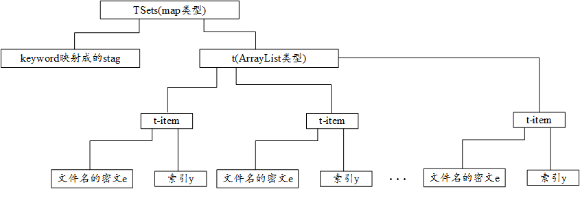
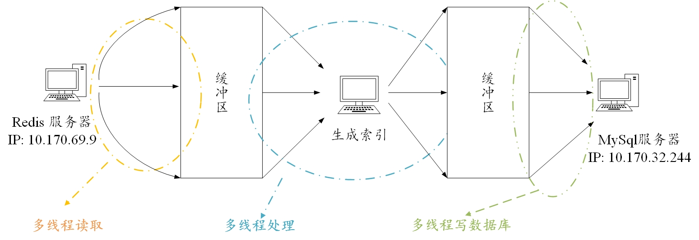
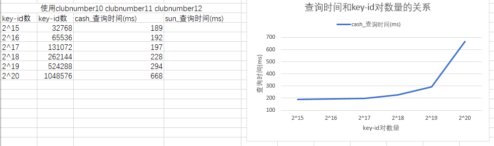

# Cash的OXT方案

## 项目组织结构
文件夹tsets_bloom_filter: 用于存放保存有tsets的bloomfilter

文件夹output_keys: 用于存放密钥

文件夹testset: 测试数据集

文件夹lib: 存放jpbc相关的jar包

文件夹params: 存放双线性对参数的文件夹

Cash实验汇报.pptx: 向老师汇报的时候使用的ppt

Cash方案实现架构.pptx: 向老师汇报的时候使用的ppt


## 参考文献
Cash-Highly-scalable searchable symmetric encryption with Support for Boolean Queries.pdf
重点参考：3.2章
TSet的结构如下：


## 实现架构

注意：这里mysql和redis都是采用了长连接的形式，这主要是因为要源源不断地从redis中读数据，向mysql中写数据，频繁地打开关闭连接会导致性能的下降
```java
private static Connection conn;                                      //连接
private static PreparedStatement pres;             //PreparedStatement对象
static {
	try {
		conn = MysqlConnPool.getConnection();
		System.out.println("数据库连接成功!!!");
	} catch (Exception e) {
		e.printStackTrace();
	}
}
```

## 想要复现实验？？
参考 如何复现实验.md

## 类的定义

## Cash的方案 与 WJF的方案的不同之处在于
1. 没有产生私钥
2. 没有产生公钥
3. 没有产生g1 g2 g3
## 对toyDB生成索引文件
```cmd
mvn test -Dtest=AlgorithmTest#EDBSetupOutputTest
```
## 对ciPing_0.txt 生成索引文件(由EDRM数据集生成的)
```cmd
mvn test -Dtest=AlgorithmTest#EDBSetupOutputTest2
```
## 对ciPing_0.txt 生成的索引文件(由enwiki数据集生成的)
```cmd
mvn test -Dtest=AlgorithmTest#EDBSetupOutputTest3
```
## 对前1000个关键词的记录生成索引文件(使用redis enwiki数据集生成的)
```cmd
mvn test -Dtest=AlgorithmTest#EDBSetupOutputTest4
```
实验结果：02:38 h
## 100次查询(由EDRM数据集生成的)
对索引ciPing_1.index进行查询，每次查询3个关键字，查询100次，然后求出平均值
```cmd
mvn test -Dtest=QueryTimeTest#t1
```
## 100次查询(由enwiki数据集生成的)
对索引ciPing_0.index进行查询，每次查询3个关键字，查询100次，然后求出平均值
```cmd
mvn test -Dtest=QueryTimeTest#t2
```
## 对比实验，对ciPing_64.txt生成索引文件

# 实验部分
### TSets和XSets
在设计数据库的时候需要考虑到搜索时的行为：
在搜索中，XSets中主要是做匹配，存储为字符串类型即可，测试下长度为311，分配400的长度
在搜索中，TSets中的stag也是为了做匹配，存储为字符串类型即可，测试下长度为74，分配100的长度
在搜索中，需要密文e 和 索引y，我们将其存储为blob类型，之后反序列化为ArrayList<t_item>对象
```sql
# 连接数据库
mysql -uroot -proot -P3306 -h10.170.32.244
CREATE DATABASE IF NOT EXISTS vsse DEFAULT CHARSET utf8 COLLATE utf8_general_ci;
use vsse
CREATE TABLE IF NOT EXISTS XSets(
	xSet VARCHAR(400)
); 
CREATE TABLE IF NOT EXISTS TSets(
	stag VARCHAR(100),
	t blob
)
```
保存数据的代码段如下 MySqlUtils#saveTSets
```java
//开始保存XSet
pres = conn.prepareStatement(sql_XSets);
for (int i = 0; i < task.getXSets().size(); i++) {
    //pres.setString(1, task.getXSets().get(i).getElement().toString());
    pres.addBatch(); //实现批量插入
}
pres.executeBatch();//批量插入到数据库中

//开始保存TSets
pres = conn.prepareStatement(sql_TSets);
pres.setString(1, task.getStag());
pres.setBytes(2, MyUtils.msg2Byte(task.getT()));
pres.execute();

if (pres != null)
	pres.close();
```
### 密钥
本算法设计到的Master Key包括：
KI：用于生成索引y
Kz：用于生成索引y
Kx：用于生成索引x
Ks：用于生成加密文件名的密钥Ke
Kt：
g：双线性对的生成元

其他的密钥包括：
Ke：通过Ks 和 关键字的 随机映射得到
### 如何运行
```cmd
cd CashScheme
mvn clean
mvn compile
mvn exec:java -Dexec.mainClass="com.zhong.concurrent.BlockingQueueModel"
```

## 实验结果
2^16 = 65,536
2^17=131,072
2^18=262,144
2^19=524,288
2^20=1,048,576
2^21=2,097,152
2^22=4,194,304

## 4月3日
生成了540000个关键词时候，我将他停止了
*******
生成测试集合：王老师要求随机取100个关键词，然后记录各自的文件名的个数
使用python脚本生成：`F:\睿云实验室\王剑锋\关键词检索\第3阶段工作-搞数据\王老师-莫纳什大学-数据集\txts\getTestSet.py`

生成的思路：从原理上说，测试使用的关键词越散乱越好，我使用如下的方法获得测试关键词：
1. 获得文件夹F:\睿云实验室\王剑锋\关键词检索\第3阶段工作-搞数据\王老师-莫纳什大学-数据集\txts下的所有文件名，并生成一个list
2. 从第一步获得的list中随机选择一个文件
3. 从第二步获得的文件中随机选择一个关键词
******
将redis中的数据存储成txt格式
```bash
mvn test -Dtest=RedisWrapperTest#getRecordsTest2
```
redis中的数据dump.rdb的路径  `F:\睿云实验室\王剑锋\关键词检索\第3阶段工作-搞数据\王老师-莫纳什大学-数据集\redis\dump.rdb`
*******
搜索时间测试： 测试的结果是3个关键词使用了37.3 min
`mvn test -Dtest=SearchProtocol_Split_memory_Test#searchProtocolTest2`
时间太长了，我又打开Cash论文的实验部分看，发现人家的XSet是用BloomFilter实现的

将MySql中的表XSets中的数据写入到BloomFilter中
```bash
mvn test -Dtest=MySqlUtilsTest#getXSetsTest2
```
做了如下的更改：
1. 将搜索XSets的算法换成从BloomFilter中读取
2. 将要搜索的关键词的个数提供给服务器
  单次查询
```bash
mvn test -Dtest=SearchProtocol_Split_memory_Test#searchProtocolTest3
```
100次查询
```bash
mvn test -Dtest=SearchProtocol_Split_memory_Test#searchProtocolTest4
```
在40W个关键词下的运行记录
```bash
100次查询需要 310966 ms
```

## 4月4日
```bash
2^16 = 65,536	100次查询需要 4032 ms
2^17=131,072	100次查询需要 6179 ms
2^18=262,144	100次查询需要 40601 ms
2^19=524,288	100次查询需要 70901 ms
2^20=1,048,576
2^21=2,097,152
2^22=4,194,304
```
复制MySql的表：

```sql
create table TSets_524288 select * from TSets limit 0,524288;
```

## 4月8日
已经处理了 2,174,391个关键词，应该考虑备份的问题了
恢复
```bash
mysql --default-character-set=utf8 -uroot -proot vsse < F:\睿云实验室\王剑锋\关键词检索\第6阶段\CashScheme\vsse_TSets.sql
```
备份
```bash
mysqldump -uroot -proot -h10.170.32.244 --default-character-set utf8 vsse TSets > /home/ruiyun/vsse_TSets.sql
mysqldump -uroot -proot -h10.170.32.244 --default-character-set utf8 vsse XSets > /home/ruiyun/vsse_XSets.sql
```

## 4月9日
多个规模的数据上的测试结果
```bash
mvn test -Dtest=SearchProtocol_Split_memory_Test#searchProtocolTest5
```

记住要更新XSets的BloomFilter
1. 将MySqlUtilsTest.java中的getXSetsTest2函数中的循环条件修改为2174000
2. 执行以下语句
```bash
mvn test -Dtest=MySqlUtilsTest#getXSetsTest2
```

其实搜索时间的长短和搜索策略有很大的影响：
1. 寻找到第一条数据就返回
2. 遍历整个TSets表
  如果采用第一种策略，则搜索时间会受到测试数据集的影响
  如果采用第二种策略，则影响搜索时间的唯一因素是TSets表的大小

第一种策略
```bash
TSets_65536 100次查询需要 5064 ms
TSets_131072 100次查询需要 6624 ms
TSets_262144 100次查询需要 7624 ms
TSets_524288 100次查询需要 110395 ms
TSets_1048576 100次查询需要 263341 ms
TSets_2097152 100次查询需要 427625 ms
```

第二种策略
```bash
TSets_65536 100次查询需要 7550 ms
TSets_131072 100次查询需要 26412 ms
TSets_262144 100次查询需要 49179 ms
TSets_524288 100次查询需要 280442 ms
TSets_1048576 100次查询需要 420282 ms
TSets_2097152 100次查询需要 650501 ms
```

查询表的大小
```sql
use information_schema
select concat(round(sum(DATA_LENGTH/1024/1024),2),'MB') as data from TABLES where table_schema='vsse' and table_name='TSets_65536';
select concat(round(sum(DATA_LENGTH/1024/1024),2),'MB') as data from TABLES where table_schema='vsse' and table_name='TSets_131072';
select concat(round(sum(DATA_LENGTH/1024/1024),2),'MB') as data from TABLES where table_schema='vsse' and table_name='TSets_262144';
select concat(round(sum(DATA_LENGTH/1024/1024),2),'MB') as data from TABLES where table_schema='vsse' and table_name='TSets_524288';
select concat(round(sum(DATA_LENGTH/1024/1024),2),'MB') as data from TABLES where table_schema='vsse' and table_name='TSets_1048576';
select concat(round(sum(DATA_LENGTH/1024/1024),2),'MB') as data from TABLES where table_schema='vsse' and table_name='TSets_2097152';
```

```bash
TSets_65536 86.5 MB
TSets_131072 140.63 MB
TSets_262144 231.70 MB
TSets_524288 410.84 MB
TSets_1048576 790.00 MB
TSets_2097152 1538.00 MB
```
## 4月11日
生成查询所需的子TSets表：
```sql
mysql -uroot -proot -h10.170.32.244
use vsse;
create table TSets_32768 select * from TSets limit 0,32768;
create table TSets_65536 select * from TSets limit 0,65536;
create table TSets_131072 select * from TSets limit 0,131072;
create table TSets_262144 select * from TSets limit 0,262144;
create table TSets_524288 select * from TSets limit 0,524288;
create table TSets_1048576 select * from TSets limit 0,1048576;
```
查询TSets表的大小
```sql
mysql -uroot -proot -h10.170.32.244
use information_schema;
select concat(round(sum(DATA_LENGTH/1024/1024),2),'MB') as data from TABLES where table_schema='vsse' and table_name='TSets_32768';
select concat(round(sum(DATA_LENGTH/1024/1024),2),'MB') as data from TABLES where table_schema='vsse' and table_name='TSets_65536';
select concat(round(sum(DATA_LENGTH/1024/1024),2),'MB') as data from TABLES where table_schema='vsse' and table_name='TSets_131072';
select concat(round(sum(DATA_LENGTH/1024/1024),2),'MB') as data from TABLES where table_schema='vsse' and table_name='TSets_262144';
select concat(round(sum(DATA_LENGTH/1024/1024),2),'MB') as data from TABLES where table_schema='vsse' and table_name='TSets_524288';
select concat(round(sum(DATA_LENGTH/1024/1024),2),'MB') as data from TABLES where table_schema='vsse' and table_name='TSets_1048576';
```
查询结果如下
```
2^15 32768 前2500个关键词 42.55MB
2^16 65536 前3500个关键词 86.5 MB
2^17 131072 前15000个关键词 140.63 MB
2^18 262144 前40000个关键词 231.70 MB
2^19 524288 前70000个关键词 410.84 MB
2^20 1048576 前229000个关键词 790.00 MB
```
## 4月11日晚
记住要更新XSets的BloomFilter
1. 将MySqlUtilsTest.java中的getXSetsTest2函数中的循环条件修改为8627058
2. 执行以下语句
```bash
mvn test -Dtest=MySqlUtilsTest#getXSetsTest2
```

一站式查询
```bash
mvn test -Dtest=SearchProtocol_Split_memory_Test#searchProtocolTest8
```

## 4月12日
使用固定的3个关键词，要求w1的文件数在100个左右，w1+w2+w3的文件数10~20个。
重复测试100次，求出平均值
在不同规模的TSets表中进行测试

建构出要查询的3个关键词，然后插入数据库中，然后打乱整个数据集

构建的关键词如下所示：
keyword1 ind1~ind100
keyword2 ind1~ind20
keyword3 ind1~ind15

有两种思路：
### 思路1
1. 向每个表中插入构建的记录
```bash
mvn test  -Dtest=EDBSetup_split_memoryTest#insertItemTest
```
记得更新BloomFilter
```bash
mvn test -Dtest=BloomFilterTest#insertItemTest
```

2. 打乱每个表 注意rand是一个很耗时的工作
```sql
create table TSets_32768_rand select * from TSets_32768 order by rand();
create table TSets_65536_rand select * from TSets_65536 order by rand();
create table TSets_131072_rand select * from TSets_131072 order by rand();
create table TSets_262144_rand select * from TSets_262144 order by rand();
create table TSets_524288_rand select * from TSets_524288 order by rand();
create table TSets_1048576_rand select * from TSets_1048576 order by rand();  28分钟
```
3. 测试时间
```bash
mvn test -Dtest=SearchProtocol_Split_memory_Test#searchProtocolTest9
```
### 思路2
单纯地打乱所有的表，采用如下的数据集进行测试
```
kws = [clubnumber10,clubnumber11,clubnumber12]
numLeastKeyword=9
```
采用如下的语句测试时间
```bash
mvn test -Dtest=SearchProtocol_Split_memory_Test#searchProtocolTest10
```
## 4月12日11点
新建了项目CashScheme_Split_Memory，CashScheme_Split_Memory项目中的readme继承自该readme

老师说不能采用我想的那种方法，而是直接选择3个关键词，我选择了
```bash
0-10000.txt
clubnumber10 9 [24110124, 24303115, 24329175, 24965832, 25101213, 25121290, 25345551, 25491023, 25703743]
clubnumber11 11 [24110124, 24303115, 24329175, 24965832, 25101213, 25121290, 25345551, 25491023, 25703743, 25753381, 26669567]
clubnumber12 9 [24110124, 24303115, 24329175, 24965832, 25101213, 25121290, 25345551, 25491023, 25703743]
```
可以正确搜索出来
```bash
5000-6000.txt
oP 4 [24171206, 24206492, 25788196, 26444472]
nk 22 [24052345, 24064208, 24171206, 24304608, 24383272, 24465848, 24497235, 24848842, 24907567, 25266655, 25446453, 25495471, 25578435, 25818717, 25847229, 25945847, 25999457, 26131309, 26498201, 26605226, 26692212, 26753936]
```
不可以正确搜索
```bash
7000-8000.txt
к 1 [24498727]
и 9 [24377835, 24384507, 24391591, 24456486, 24498727, 24577182, 24616873, 24698312, 24729060]
в 14 [24339874, 24394706, 24399599, 24434770, 24457567, 24458162, 24469752, 24487853, 24498727, 24500987, 24674144, 24689385, 24698040, 24727257]
```
不可以正确搜索
单关键词的搜索是没有问题的，但是多关键词的时候会出现问题

## 4月12日晚上
老师忽然又说要采用第二种方案去测试时间，实验结果如下图所示


我想试一下在访问本地的MySql服务器和访问MySql服务器在查询时间上有什么区别
结果上传备份的  .sql 文件的时候特别慢，，花了10 min

## 4月14日
我怀疑当时建立的子表是错误的

生成查询所需的子TSets表：
```sql
mysql -uroot -proot -h10.170.32.244
use vsse;
create table TSets_32768_v2 select * from TSets limit 0,2500;
create table TSets_65536_v2 select * from TSets limit 0,3500;
create table TSets_131072_v2 select * from TSets limit 0,15000;
create table TSets_262144_v2 select * from TSets limit 0,40000;
create table TSets_524288_v2 select * from TSets limit 0,70000;
create table TSets_1048576_v2 select * from TSets limit 0,229000;
```
查询TSets表的大小
```sql
mysql -uroot -proot -h10.170.32.244
use information_schema;
select concat(round(sum(DATA_LENGTH/1024/1024),2),'MB') as data from TABLES where table_schema='vsse' and table_name='TSets_32768_v2';
select concat(round(sum(DATA_LENGTH/1024/1024),2),'MB') as data from TABLES where table_schema='vsse' and table_name='TSets_65536_v2';
select concat(round(sum(DATA_LENGTH/1024/1024),2),'MB') as data from TABLES where table_schema='vsse' and table_name='TSets_131072_v2';
select concat(round(sum(DATA_LENGTH/1024/1024),2),'MB') as data from TABLES where table_schema='vsse' and table_name='TSets_262144_v2';
select concat(round(sum(DATA_LENGTH/1024/1024),2),'MB') as data from TABLES where table_schema='vsse' and table_name='TSets_524288_v2';
select concat(round(sum(DATA_LENGTH/1024/1024),2),'MB') as data from TABLES where table_schema='vsse' and table_name='TSets_1048576_v2';
```
打乱每个表 注意rand是一个很耗时的工作
```sql
use vsse;
create table TSets_32768_rand_v2 select * from TSets_32768_v2 order by rand();
create table TSets_65536_rand_v2 select * from TSets_65536_v2 order by rand();
create table TSets_131072_rand_v2 select * from TSets_131072_v2 order by rand();
create table TSets_262144_rand_v2 select * from TSets_262144_v2 order by rand();
create table TSets_524288_rand_v2 select * from TSets_524288_v2 order by rand();
create table TSets_1048576_rand_v2 select * from TSets_1048576_v2 order by rand();  
```

## 测试正确性
```bash
mvn test -Dtest=SearchProtocol_Split_memory_Test#search_serverTest12
```

## 测试查询时间 
```bash
mvn test -Dtest=SearchProtocol_Split_memory_Test#searchProtocolTest13
```